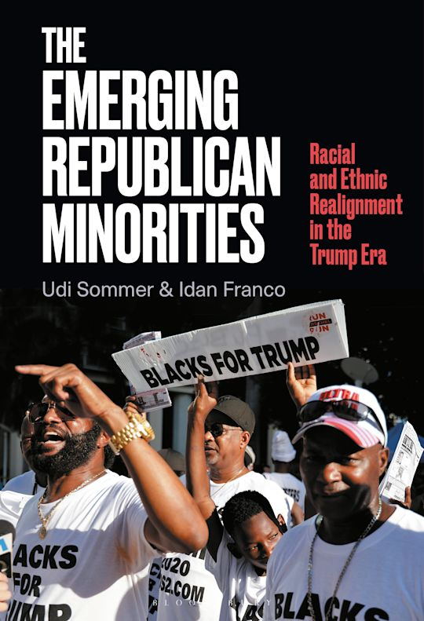

## [*The Emerging Republican Minorities: Racial and Ethnic Realignment in the Trump Era*]( https://www.bloomsbury.com/us/emerging-republican-minorities-9798765134153/)

Bloomsbury Academic, 2025, (with Udi Sommer).

**Recommended by** *CHOICE: Current Reviews for Academic Libraries*, the premier review journal of new academic titles, published by the Association of College and Research Libraries (August 2025):

> "A timely and important book … the authors compel us to reconsider the oft-repeated claim of emerging Democratic majorities with more diverse electorates. Demographics are not destiny."

**Read Thomas Edsall's [column](https://www.nytimes.com/2026/02/17/opinion/trump-coalition-multiracial-working-class.html) in *The New York Times*, discussing our book.**

{.book-cover fig-alt="Cover of The Emerging Republican Minorities"}

---

**How is it possible that Donald Trump, a champion of racist and anti-immigrant policies, has only attracted more minority voters since 2016? Drawing on extensive statistical analyses, this book challenges the conventional wisdom on Black, Latino, and Asian American voters.**

Positing a host of theoretical innovations based on diverse data sources, The Emerging Republican Minorities establishes that some of the most heated debates of the Trump era-race, immigration, and relations with China-had effects on minority voters that challenged a paradigm ascribing their automatic loyalty to the Democrats. For Black, Latino/a, and Asian American constituents, much like for their white counterparts, minority-hostile positions are critical in explaining how members of those same minority groups vote, even for candidates who prima facie should not win any of their support.

We analyze detailed regression models and conduct robust empirical tests to demonstrate how minority constituencies are more ideologically diverse than commonly thought, even on such issues where we would expect near unanimity, such as opinions towards their own communities. Moreover, this diversity complicates the way we think and theorize not only about minority political behavior but also about democracy and its vitality in the Trump and post-Trump eras.
